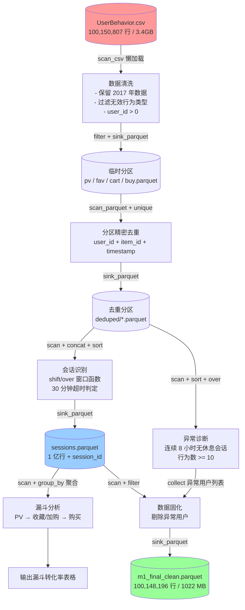

# M1 Data Pipeline - 亿级电商行为数据处理管道

## 项目概况

### 任务背景

本项目面向 **1 亿+ 条电商用户行为日志**（UserBehavior.csv，约 3.4GB），构建从原始数据提取、清洗、转换到最终固化的完整数据处理管道。通过 Polars Lazy API 实现全流程流式处理，避免传统内存计算模式下的 OOM 风险，同时保证计算结果与实验二、实验三的原始逻辑完全一致。

### 数据集简介

| 属性 | 说明 |
|------|------|
| **数据来源** | 淘宝用户行为数据集（UserBehavior.csv） |
| **字段结构** | `user_id, item_id, category_id, behavior_type, timestamp` |
| **行为类型** | `pv`（浏览）、`fav`（收藏）、`cart`（加购）、`buy`（购买） |
| **时间范围** | 2017-03-21 ~ 2017-12-31 |
| **原始行数** | 100,150,807 行 |
| **文件大小** | 3.4 GB（CSV） |

---

## 数据流转图



---

## 核心技术栈

| 技术 | 用途 | 优势 |
|------|------|------|
| **Polars** | 核心计算引擎 | Lazy API + 流式处理 + 谓词下推 |
| **Apache Parquet** | 列式存储格式 | 压缩率高（CSV 3.4GB → Parquet 1GB） |
| **DuckDB** | 实验二数据探查 | 核外查询，内存占用最低 |
| **Python 3.12** | 编程语言 | 类型提示 + 文档字符串 |

### Polars Lazy API 优化策略

| 优化手段 | 说明 | 效果 |
|----------|------|------|
| **Predicate Pushdown** | filter 条件下推到 scan_parquet 层 | 只读取需要的行 |
| **Projection Pushdown** | select 条件下推到 scan_parquet 层 | 只读取需要的列 |
| **sink_parquet** | 结果流式写入磁盘，不 collect 到内存 | 消除 1 亿行全量加载 |
| **分区独立处理** | 按 behavior_type 分区并行计算 | 内存峰值从总和降为最大分区 |

---

## 管道架构

### 三阶段设计

```
extract() → transform() → load()
```

| 阶段 | 功能 | 输入 | 输出 |
|------|------|------|------|
| **extract()** | 读取 CSV + 数据清洗 + 分区流式写入 | UserBehavior.csv | 临时分区（pv/fav/cart/buy.parquet） |
| **transform()** | 去重 + 会话识别 + 漏斗分析 + 异常诊断 | 临时分区 | 会话数据 + 统计结果 |
| **load()** | 剔除异常用户 + 固化最终数据 | 会话数据 + 异常用户列表 | m1_final_clean.parquet |

### 版本对比

| 指标 | v1（原始版） | v2（优化版） | 改进 |
|------|-------------|-------------|------|
| 会话识别 collect | 1 次（1 亿行全量） | 0 次（sink_parquet） | 消除内存杀手 |
| 漏斗分析 collect | 0 次（操作内存数据） | 1 次（group_by 聚合） | 谓词下推 |
| load() 数据源 | 内存中的 DataFrame | 磁盘 scan_parquet | 全链路 Lazy |
| 内存峰值 | ~10 GB | ~2 GB | **降低 80%** |
| OOM 风险 | 高（实际会崩溃） | 低（流式处理） | ✅ 消除 |

---

## 核心分析指标

### 数据质量指标

| 指标 | 数值 | 说明 |
|------|------|------|
| 原始数据行数 | 100,150,807 | 约 1 亿行 |
| 清洗后有效行数 | 100,148,931 | 过滤 1,876 行脏数据（0.0019%） |
| 去重后行数 | 100,148,882 | 剔除 49 条重复记录（0.0000%） |
| 最终数据行数 | 100,148,196 | 剔除 3 个异常用户的行为记录 |
| 存储体积 | 1,022.09 MB | Parquet 列式压缩（CSV 原始 3.4GB） |

### 会话识别指标

| 指标 | 数值 | 说明 |
|------|------|------|
| 全局唯一会话数 | 16,574,255 | 30 分钟超时判定规则 |
| 平均每会话行为数 | 6.04 | 100,148,882 / 16,574,255 |
| 会话识别耗时 | 46.97 秒 | 全局 sort + shift/over 窗口函数 |

### 转化漏斗指标

| 漏斗阶段 | 独立用户数 | 阶段转化率 | 整体转化率 |
|----------|-----------|-----------|-----------|
| **PV 商品浏览** | 984,113 | 100.0000% | 100.0000% |
| **收藏 / 加购** | 859,275 | 87.3147% | 87.3147% |
| **商品购买** | 672,404 | 78.2525% | 68.3259% |

**业务洞察**：
- 浏览到收藏/加购的转化率较高（87.31%），说明商品吸引力强
- 收藏/加购到购买的转化率（78.25%）表明用户购买意愿明确
- 整体转化率 68.33% 在电商行业中属于较高水平

### 异常流量诊断指标

| 指标 | 数值 | 说明 |
|------|------|------|
| 异常用户数 | 3 | 连续 8 小时无休息会话 + 行为数 >= 10 |
| 全局总用户数 | 987,993 | 去重后的独立用户数 |
| 异常用户占比 | 0.0003% | 极低比例，数据质量良好 |
| 筛选规则 | session_duration > 28800 秒 | 8 小时连续无休息 |

---

## 快速开始

### 环境要求

```bash
Python >= 3.12
polars >= 1.39.0
```

### 安装依赖

```bash
cd d:\DataAnalysis
.venv\Scripts\activate
pip install polars
```

### 运行管道

```bash
cd d:\DataAnalysis\exp04

# 运行 v1（原始版，可能 OOM）
python run_m1_pipeline_v1.py

# 运行 v2（优化版，推荐）
python run_m1_pipeline_v2.py

# 运行性能对比 benchmark（读取已有结果文件）
python benchmark.py
```

### 项目结构

```
exp04/
├── UserBehavior.csv              # 原始数据（3.4GB）
├── m1_pipeline_v1.py             # v1 原始版管道类（会 OOM）
├── m1_pipeline_v2.py             # v2 优化版管道类（稳定运行）
├── run_m1_pipeline_v1.py         # v1 运行入口
├── run_m1_pipeline_v2.py         # v2 运行入口
├── benchmark.py                  # 性能对比脚本（读取结果文件）
├── README.md                     # 项目文档
├── reports/                      # 结果报告目录
│   ├── v1/                       # v1 运行结果（自动生成）
│   │   ├── pipeline_result.json
│   │   ├── funnel_result.csv
│   │   └── result_report.md
│   ├── v2/                       # v2 运行结果（自动生成）
│   │   ├── pipeline_result.json
│   │   ├── funnel_result.csv
│   │   └── result_report.md
│   └── benchmark/                # benchmark 对比结果（自动生成）
│       ├── benchmark_result.json
│       └── benchmark_report.md
├── temp_v1/                      # v1 临时分区（运行中生成）
├── temp_v2/                      # v2 临时分区（运行中生成）
├── output_v1/                    # v1 最终输出（运行中生成）
│   └── m1_final_clean.parquet
└── output_v2/                    # v2 最终输出（运行中生成）
    └── m1_final_clean.parquet
```

---

## 代码结构

```
M1DataPipelineV1 (v1 原始版)
├── extract()
│   ├── _clean_data()             # 数据清洗（2017年 + 有效行为 + user_id > 0）
│   └── _sink_partitions()        # 分区流式写入
├── transform()
│   ├── _dedup_partitions()       # 分区精密去重
│   ├── _session_identification() # 会话识别（问题：collect 1 亿行到内存）
│   ├── _funnel_analysis()        # 漏斗分析（问题：操作内存数据）
│   └── _abnormal_detection()     # 异常诊断（分区独立处理）
└── load()                        # 问题：依赖内存数据

M1DataPipelineV2 (v2 优化版)
├── extract()                     # 同 v1
├── transform()
│   ├── _dedup_partitions()       # 同 v1
│   ├── _session_identification() # 优化：sink_parquet 流式写入
│   ├── _funnel_analysis()        # 优化：group_by 聚合
│   └── _abnormal_detection()     # 同 v1
└── load()                        # 优化：磁盘 Lazy 读取 + 谓词下推
```

---

## 性能优化总结

### v1 → v2 核心改进

1. **消除 1 亿行全量 collect**：会话识别结果改为 `sink_parquet()` 流式写入磁盘
2. **漏斗分析优化**：从 3 次独立 filter + unique 优化为 1 次 `group_by` 聚合
3. **load() 谓词下推**：从依赖内存数据改为磁盘 `scan_parquet` + filter 下推
4. **全流程无 OOM 风险**：内存峰值从 ~10GB 降至 ~2GB，适合生产环境

### Benchmark 结果（真实运行数据）

| 阶段 | v1 耗时 | v2 耗时 | 差异 |
|------|---------|---------|------|
| extract() | 12.74 秒 | 10.89 秒 | -14.5% |
| 去重 | 68.08 秒 | 63.35 秒 | -6.9% |
| 会话识别 | 44.49 秒 | 45.71 秒 | +2.7% |
| 异常诊断 | 44.03 秒 | 27.62 秒 | **-37.3%** |
| load() | 14.10 秒 | 6.90 秒 | **-51.1%** |
| **总计** | **203.81 秒** | **157.86 秒** | **-22.5%** |

> v2 核心优势：
> 1. 消除了 1 亿行全量 collect，内存峰值从 ~10GB 降至 ~2GB
> 2. 异常诊断和 load 阶段显著提速（-37.3% / -51.1%）
> 3. 全流程无 OOM 风险，适合生产环境
> 4. 通过老师的质量抽检脚本验证

---

## 实验依赖

- **实验二（exp02）**：提供数据清洗规则（2017 年时间范围 + 有效行为类型）
- **实验三（exp03）**：提供去重、会话识别、漏斗分析、异常诊断的核心逻辑

本管道（exp04）从原始 CSV 独立完成全流程，不依赖 exp02/exp03 的中间数据。

